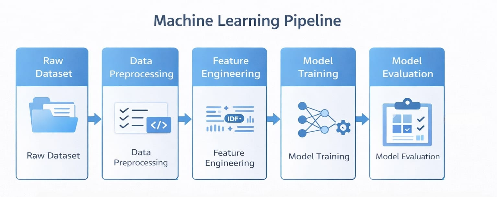
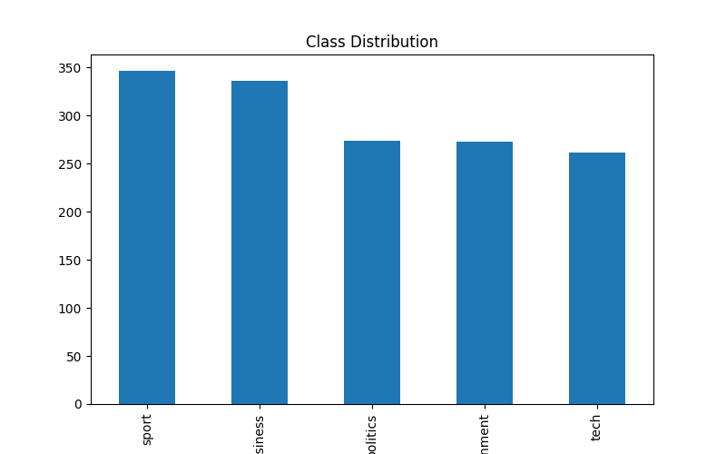
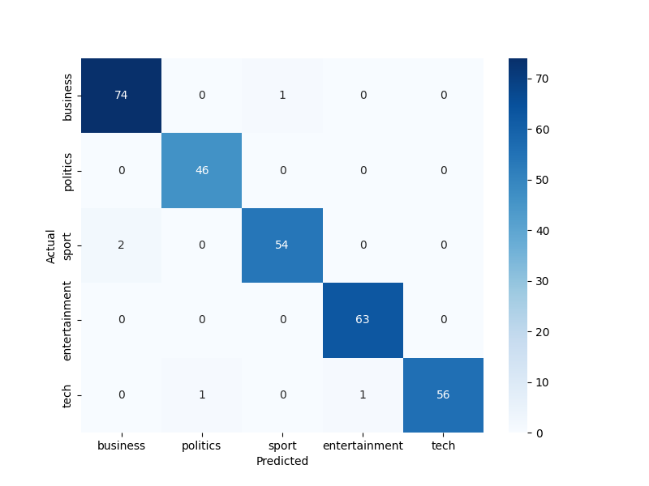
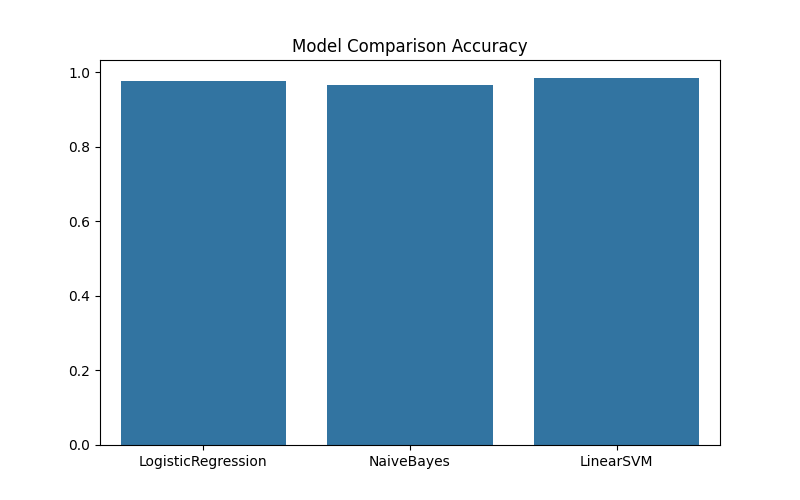

# News Article Classification using Machine Learning

## Project Overview

This project implements an end-to-end Machine Learning pipeline for news article classification.  
The system automatically categorizes news articles into predefined categories such as:

- Business
- Politics
- Sport
- Entertainment
- Technology

The project demonstrates a **production-style machine learning workflow**, including data preprocessing, feature engineering, model training, evaluation, visualization, and inference.

All components are implemented using **Python scripts and a modular project structure**, ensuring the pipeline can be executed entirely from the command line.

# Key Features

- End-to-end Machine Learning pipeline for text classification
- TF-IDF feature engineering with unigram and bigram support
- Comparison of multiple machine learning models
- Automatic best-model selection
- Visualization of dataset and model performance
- Command-line based pipeline execution
- Modular and scalable project structure
---
## Installation

1. **Clone the repository**

```bash
git clone https://github.com/shrutivinodshinde/News-Article-Classification-ML.git
```

2. **Navigate to the project directory**

```bash
cd News-Article-Classification-ML
```

3. **Create a virtual environment (recommended)**

```bash
python -m venv venv
```

4. **Activate the virtual environment**

Windows:

```bash
venv\Scripts\activate
```

Mac/Linux:

```bash
source venv/bin/activate
```

5. **Install required dependencies**

```bash
pip install -r requirements.txt
```

# Dataset

Dataset used: **BBC News Dataset**

Source:
https://www.kaggle.com/competitions/learn-ai-bbc

The dataset contains labeled news articles across five categories:

| Category | Description |
|--------|--------|
| Business | Financial markets, companies, economy |
| Politics | Government, elections, policy |
| Sport | Football, tennis, athletics |
| Entertainment | Movies, music, television |
| Tech | Technology, software, digital innovation |
### Dataset Setup

1 Download dataset from Kaggle  
2 Extract files  
3 Place dataset inside:

```
data/raw/
```

# Project Architecture

The project follows a modular architecture that separates each stage of the machine learning pipeline.

```

news_classification_project/

├── data/
│ ├── raw/                 # Original dataset
│ └── processed/           # Cleaned dataset

├── src/
│ ├── config.py            # Global configuration paths
│ ├── data_preprocessing.py
│ ├── feature_engineering.py
│ ├── train.py
│ ├── evaluate.py
│ ├── visualization.py
│ └── test_predictions.py

├── models/
│ └── news_classifier.pkl

├── results/
│ ├── metrics.txt
│ ├── confusion_matrix.png
│ ├── class_distribution.png
│ ├── model_comparison.png
│ ├── top_words.png
│ ├── pipeline_workflow.png
│ └── test_predictions.txt

├── requirements.txt
├── README.md
└── main.py

```
# Running the Pipeline

Run the complete machine learning pipeline:

```bash
python main.py
```
---

# Pipeline Workflow

The following diagram illustrates the complete machine learning workflow used in this project.



Pipeline stages:

1 Data preprocessing  
2 Feature engineering  
3 Model training  
4 Model evaluation  
5 Visualization generation  
6 Model inference 

---

# Machine Learning Pipeline

## 1 Data Preprocessing

The preprocessing stage prepares raw text data for machine learning.

Steps performed:

- Load dataset
- Handle missing values
- Convert text to lowercase
- Remove punctuation and special characters
- Remove stopwords using NLTK

Example transformation:

Original:

"The Government announced new tax reforms."

Processed:

government announced new tax reforms

---

# 2 Feature Engineering

Text data is converted into numerical features using **TF-IDF Vectorization**.

Configuration:

- Maximum features: 10,000
- N-gram range: (1,2) → unigrams + bigrams

TF-IDF captures the importance of words relative to the corpus, improving model performance.

Example features:

"football match"  
"stock market"  
"prime minister"

---

# 3 Model Training

Three machine learning models were trained and compared.

| Model | Description |
|------|------|
| Logistic Regression | Linear classification model |
| Multinomial Naive Bayes | Probabilistic model for text |
| Linear Support Vector Machine | High-performance linear classifier |

The models were evaluated on a train/test split and the best-performing model was automatically selected.

Best Model:  
**Linear Support Vector Machine (LinearSVM)**

---

# 4 Model Evaluation

The model was evaluated using several metrics:

- Accuracy
- Precision
- Recall
- F1 Score
- Confusion Matrix

Final Accuracy:

```

98.32%

```

Classification Report:

| Category | Precision | Recall | F1 |
|--------|--------|--------|--------|
| Business | 0.97 | 0.99 | 0.98 |
| Entertainment | 0.98 | 1.00 | 0.99 |
| Politics | 0.98 | 0.96 | 0.97 |
| Sport | 0.98 | 1.00 | 0.99 |
| Tech | 1.00 | 0.97 | 0.98 |

Results are stored in:

```

results/metrics.txt

```

---

# Visualizations

Several visualizations were generated to better interpret the dataset and model performance.

### Class Distribution

Shows how many articles belong to each category.

Helps verify dataset balance.



---

### Confusion Matrix

Displays prediction accuracy for each class and highlights misclassifications.



---

### Model Comparison

Compares the performance of all trained models.

Linear SVM achieved the best accuracy.


---

### Top Important Words

Shows the most influential TF-IDF features learned by the classifier.

Examples:

Business → market, bank, shares  
Sport → match, players, champion  
Tech → computer, software, digital

---

# Model Inference

A testing script allows classification of new unseen news sentences.

Run:

```

python -m src.test_predictions

```

Example predictions:

```

Sentence: Apple released a new artificial intelligence chip
Predicted Category: tech

Sentence: Manchester United won the football match
Predicted Category: sport

Sentence: The prime minister addressed parliament
Predicted Category: politics

```

Predictions are saved to:

```

results/test_predictions.txt

```

---

# Technologies Used

- Python
- Scikit-learn
- Pandas
- NumPy
- NLTK
- Matplotlib
- Seaborn

---

# Key Learnings

- TF-IDF feature extraction
- Supervised text classification
- Model comparison and selection
- Evaluation using multiple metrics
- Visualization for model interpretation
- Building reproducible ML pipelines

---
# Author

**Shruti Vinod Shinde**

Machine Learning & Data Science Enthusiast

GitHub:  
https://github.com/shrutivinodshinde 
---
